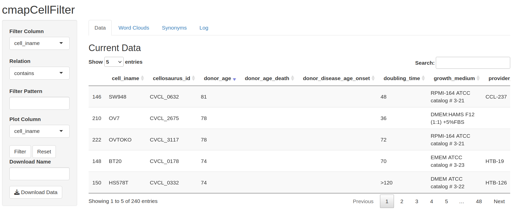

# larimaR
L1000/CMAP Data Exploration and Analysis Tools

LarimaR is designed to help explore and use the L1000 data provided by clue.io

# Demo

## Download data

The first step is to download the CMAP data in gctx format along with the metadata files needed for the extraction.

The data can be located here:

https://clue.io/data/CMap2020#LINCS2020

Download the following files:

* level5_beta_trt_cp_n720216x12328.gctx - expression data for compounds
* cellinfo_beta.txt - cell information
* compoundinfo_beta.txt - compound information
* siginfo_beta.txt - experimental information


## Search for cells/pertunagens with shiny apps

LarimaR comes with 2 Shiny based filter apps based on cell and perturbagen data

runCmapCellFilter(cellFile) and runCmapPertFilter(pertFile)

These functions use the files downloaded above, and can be useful to choose a pertubagen and cell of interest.

```R
dataDir="/Research/data"
cellFile="cellinfo_beta.txt"
runCmapCellFilter(paste0(dataDir,"/",cellFile))
```

Click "Reset" to load all of the data for filtering.

You should see something like:



Using this, we can search for lung related cells and export a csv

Similarly, we can use the pertunagen seaech tool to find mtor inhibitors and export a csv of perturbagens.


## Export data

The main function in larimaR is getDosagePipeline() which extracts data from a LINCS compatible dataset.

This function takes in a number of parameters:

* pertName: the string form of a perturbagen
* sigInfo: the data object containing the experimental metadata from a LICS dataset
* gctxFileLocation: the location on disk of the gctx formated data file
* cell: the name of the cell to extract data from
* curphase: the phase of the data used in the extraction. This is needed to resolve changes across phases.

Then we can set our file locations:

```R
dataDir="/Research/data"
sigInfo3=read.csv(paste0(dataDir,"/siginfo_beta.txt"),sep="\t")
sigInfoFile=paste0(dataDir,"/siginfo_beta.txt")
compounds=read.csv(paste0(dataDir,"/compoundinfo_beta.txt"),sep="\t")
cells=read.csv(paste0(dataDir,"/cellinfo_beta.txt"),sep="\t")
gctxFile3=paste0(dataDir,"/level5_beta_trt_cp_n720216x12328.gctx")
```

LarimaR has tools to look up internal identfiers using common names:

```R
library(DT)
brds=getBRDS("sirolimus",sigInfo3)
print(brds)
```

 [1] "BRD-K84937637" "BRD-A79768653" "BRD-A50287119" "BRD-A23770159"
 [5] "BRD-K89626439" "BRD-K99369265"

We can then extract the data for this pertubagens and cell combination and compute estimated cell viability

```R
res3=getDosagePipeline(
      pertName="sirolimus",
      sigInfo=sigInfo3,
      gctxFileLocation=gctxFile3,
      cell="A549",
      curphase=3
    )
```

```R
> str(res3,1)
List of 7
 $ pertName: chr "sirolimus"
 $ broadIDS: chr [1:6] "BRD-K84937637" "BRD-A79768653" "BRD-A50287119" "BRD-A23770159" ...
 $ cell    : chr "A549"
 $ expData : num [1:978, 1:94] 3.6051 -0.0129 0.6425 1.256 -3.1856 ...
  ..- attr(*, "dimnames")=List of 2
 $ dosages :List of 376
  ..- attr(*, "dim")= int [1:2] 4 94
  ..- attr(*, "dimnames")=List of 2
 $ achilles: Named num [1:94] -1.48 -1 -1.03 -1.12 -1.5 ...
  ..- attr(*, "names")= chr [1:94] "RAD001_A549_6H:BRD-K84937637-001-03-2:10" "RAD001_A549_6H:BRD-K84937637-001-03-2:0.0046" "RAD001_A549_6H:BRD-K84937637-001-03-2:0.0015" "RAD001_A549_6H:BRD-K84937637-001-03-2:3.3333" ...
 $ phase   : num [1:94] 3 3 3 3 3 3 3 3 3 3 ...

```

And plot the current extract in relation to estimated cell viability

```R
 plotCmapDosage(res3)
```


## Extreme Response Demo

We can use the shiny apps above to generate a list of MTOR inhibitors in our data. We can take the csv that comes from the app as an input in our tables and
visualizations

```R
> inh[1:10,]
         pert_id   cmap_name target                                moa
1  BRD-A50998626 palomid-529   MTOR                      Akt inhibitor
2  BRD-K12184916  NVP-BEZ235   MTOR                     MTOR inhibitor
3  BRD-A50998626 palomid-529   MTOR                     MTOR inhibitor
4  BRD-K40175214     torin-1   MTOR                     MTOR inhibitor
5  BRD-K68174511     torin-2   MTOR                     MTOR inhibitor
6  BRD-K12184916  NVP-BEZ235   MTOR                     PI3K inhibitor
7  BRD-K40175214     torin-1   MTOR                     PI3K inhibitor
8  BRD-A50998626 palomid-529   MTOR                    VEGFR inhibitor
9  BRD-A50998626 palomid-529   MTOR Fibroblast growth factor inhibitor
10 BRD-K27305650   LY-294002   MTOR                      PLK inhibitor
                                                                canonical_smiles
1                                COc1ccc(COc2cc3oc(=O)c4cc(ccc4c3cc2OC)C(C)O)cc1
2                 Cn1c2cnc3ccc(cc3c2n(-c2ccc(cc2)C(C)(C)C#N)c1=O)-c1cnc2ccccc2c1
3                                COc1ccc(COc2cc3oc(=O)c4cc(ccc4c3cc2OC)C(C)O)cc1
4  CCC(=O)N1CCN(CC1)c1ccc(cc1C(F)(F)F)-n1c2c(ccc1=O)cnc1ccc(cc21)-c1cnc2ccccc2c1
5                      Nc1ccc(cn1)-c1ccc2ncc3ccc(=O)n(-c4cccc(c4)C(F)(F)F)c3c2c1
6                 Cn1c2cnc3ccc(cc3c2n(-c2ccc(cc2)C(C)(C)C#N)c1=O)-c1cnc2ccccc2c1
7  CCC(=O)N1CCN(CC1)c1ccc(cc1C(F)(F)F)-n1c2c(ccc1=O)cnc1ccc(cc21)-c1cnc2ccccc2c1
8                                COc1ccc(COc2cc3oc(=O)c4cc(ccc4c3cc2OC)C(C)O)cc1
9                                COc1ccc(COc2cc3oc(=O)c4cc(ccc4c3cc2OC)C(C)O)cc1
10                                         O=c1cc(oc2c(cccc12)-c1ccccc1)N1CCOCC1
                     inchi_key compound_aliases
1  YEAHTLOYHVWAKW-UHFFFAOYSA-N      PALOMID-529
2  JOGKUKXHTYWRGZ-UHFFFAOYSA-N       dactolisib
3  YEAHTLOYHVWAKW-UHFFFAOYSA-N      PALOMID-529
4  AKCRNFFTGXBONI-UHFFFAOYSA-N          TORIN-1
5  GUXXEUUYCAYESJ-UHFFFAOYSA-N          TORIN-2
6  JOGKUKXHTYWRGZ-UHFFFAOYSA-N       dactolisib
7  AKCRNFFTGXBONI-UHFFFAOYSA-N          TORIN-1
8  YEAHTLOYHVWAKW-UHFFFAOYSA-N      PALOMID-529
9  YEAHTLOYHVWAKW-UHFFFAOYSA-N      PALOMID-529
10 CZQHHVNHHHRRDU-UHFFFAOYSA-N
```


The cmapExtreme function extracts the data for a particular gene across all perturbagens in a cell.

* ' Function to isolate top and bottom perturbagens for a particular gene and cell
* ' @param cellName name of cmap cell
* ' @param geneName gene of interest
* ' @param gctxFile filepath for a gctx file to subset
* ' @param phase which phase of data are we using
* ' @return a list of dataframes cellsxgenesxperturbations
* ' @export

```R
extreme=cmapExtreme(cellName="A549",
    geneName="EGFR",
    sigInfoFile=sigInfoFile,
    gctxFile=gctxFile3,
    phase=3
  )
save(extreme,file="extreme.rda")
```

We can also view data extracts in terms of identified targets.

Consider the data extract for A375-EGFR presented in the "inst" directory

This file was extracted using the code:

```R
extreme=cmapExtreme(cellName="A549",
    geneName=gene,
    sigInfoFile=sigInfoFile,
    gctxFile=gctxFile,
    phase=3
  )
```

and merged with the metadata from the siginfo file

```R
  extreme=merge(extreme,sigInfo,by="sig_id")
  fname=paste0("A549-",gene,".rda")
  save(extreme,file=fname)
```

We can load this extract to view the expression of a gene of interest as a function
of an inhibitor or enhancer.

Here:

* mtorFile is an extract of mtor inhibitors from above
* A375 File contains EGFR expression values from the A375 Cell


```R
mtorFile=paste(path.package("larimaR"),"/mtor2024-08-12.csv",sep="")
A375File=paste(path.package("larimaR"),"/A549-EGFR.rda",sep="")
cmapDT(A375File,mtorFile,inhibit=FALSE,subClass="MTOR",gene="EGFR")
```


We can also view histograms and boxplots in reference to a perturbagen class extracted above

```R
cmapBoxPlot(A375File,mtorFile,gene="EGFR")
```


```R
cmapHistPlot(A375File,mtorFile,gene="EGFR")
```

